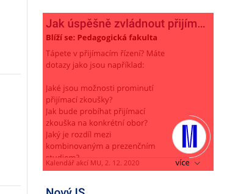
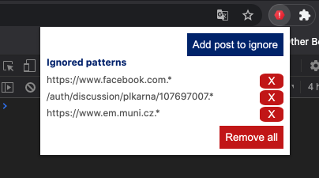

# MUNI IS spam remover

Tired of annoying posts spamming your pretty home page in MUNI IS?
Install this extension to get rid of them!

## Chrome

Chrome version is not signed → you need to add it in developer mode.
*More Tools* → *Extensions* → *check Developer mode* → *Load unpacked*.

## Firefox

***Yet to be updated to new version***

Firefox version is signed, you can add the extension via *Add-ons* → *Extensions*
→ *Install Add-on From File*.

## Usage

You can now select which posts do you want to ignore. Just open popup and select
**Add post to ignore**. Then navigate using mouse to the post you want to ignore and click on it.

The post (and whole discussion in case the post is part of discussion) is ignored now
on. You can see ignored posts in the extension popup.

You can stop ignoring post anytime by clicking on the respective ***X*** button.
